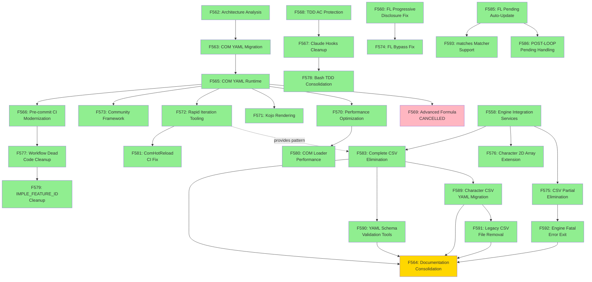

# Feature Dependency Graph (F563-F593)

This document visualizes the dependency relationships between features F563-F593, which represent the COM YAML Migration and CSV Elimination phases of the codebase modernization effort.

## Overview

The feature chain consists of:
- **Core Chain**: F563 → F565 → F569-F573 (COM YAML foundation and runtime)
- **Infrastructure Features**: F566-F568, F574, F577-F579, F582, F584-F586 (CI/testing/workflow)
- **CSV Migration Features**: F575-F576, F583, F589, F591-F592 (Data format modernization)
- **Tooling Features**: F580-F581, F590 (Performance, validation, hot-reload)
- **Documentation Features**: F564 (Consolidation)
- **Workflow Features**: F587-F588, F593 (Testing infrastructure)

---

## Dependency Visualization



---

## Feature Descriptions

### Core Chain (COM YAML)

| Feature | Status | Description | Link |
|:-------:|:------:|-------------|------|
| F562 | ✅ | Architecture Analysis - F562 analysis defining C#/YAML boundary and Tier-based moddability | [feature-562.md](../../agents/feature-562.md) |
| F563 | ✅ | COM YAML Migration - Migrated 152 COM C# classes to YAML format with effect handlers | [feature-563.md](../../agents/feature-563.md) |
| F565 | ✅ | COM YAML Runtime Integration - Complete runtime execution with formula evaluation | [feature-565.md](../../agents/feature-565.md) |
| F569 | ❌ | Advanced Formula Expressions - CANCELLED (F565 already implements) | [feature-569.md](../../agents/feature-569.md) |
| F570 | ✅ | Performance Optimization - YAML-based runtime performance tuning | [feature-570.md](../../agents/feature-570.md) |
| F571 | ✅ | Kojo Rendering Integration - RenderKojo method full integration | [feature-571.md](../../agents/feature-571.md) |
| F572 | ✅ | Rapid Iteration Tooling - Hot-reload and validation cycles | [feature-572.md](../../agents/feature-572.md) |
| F573 | ✅ | Community Customization Framework - Extensibility patterns for modding | [feature-573.md](../../agents/feature-573.md) |

### Infrastructure Features (CI and Testing)

| Feature | Status | Description | Link |
|:-------:|:------:|-------------|------|
| F566 | ✅ | Pre-commit CI Modernization - Updated CI integration for dotnet test | [feature-566.md](../../agents/feature-566.md) |
| F567 | ✅ | Claude Code Hooks Cleanup - Consolidated hook implementation | [feature-567.md](../../agents/feature-567.md) |
| F568 | ✅ | TDD AC Protection Hook - Protection for Era.Core.Tests and tests/ac | [feature-568.md](../../agents/feature-568.md) |
| F574 | ✅ | FL Bypass Fix - Progressive Disclosure enforcement for /fl workflow | [feature-574.md](../../agents/feature-574.md) |
| F577 | ✅ | Workflow Dead Code Cleanup - Removed obsolete workflow code | [feature-577.md](../../agents/feature-577.md) |
| F578 | ✅ | Bash TDD Consolidation - Unified Bash-based TDD protection | [feature-578.md](../../agents/feature-578.md) |
| F579 | ✅ | IMPLE_FEATURE_ID Cleanup - Removed legacy feature ID references | [feature-579.md](../../agents/feature-579.md) |
| F582 | ✅ | FL Workflow persist_pending Definition - Guidance for pending status handling | [feature-582.md](../../agents/feature-582.md) |
| F584 | ✅ | Testing SKILL.md AC Method Format - Standardized AC table Method column | [feature-584.md](../../agents/feature-584.md) |
| F585 | ✅ | FL Workflow pending Auto-Update - Automated pending status management | [feature-585.md](../../agents/feature-585.md) |
| F586 | ✅ | POST-LOOP Pending Handling - Final pending status resolution | [feature-586.md](../../agents/feature-586.md) |

### CSV Migration Features

| Feature | Status | Description | Link |
|:-------:|:------:|-------------|------|
| F575 | ✅ | CSV Partial Elimination - VariableSize/GameBase YAML migration | [feature-575.md](../../agents/feature-575.md) |
| F576 | ✅ | Character 2D Array Extension - Extended 2D array support for character data | [feature-576.md](../../agents/feature-576.md) |
| F583 | ✅ | Complete CSV Elimination - 23 YAML loaders for remaining file types | [feature-583.md](../../agents/feature-583.md) |
| F589 | ✅ | Character CSV YAML Migration - Chara*.csv file migration | [feature-589.md](../../agents/feature-589.md) |
| F591 | ✅ | Legacy CSV File Removal - Final CSV elimination step | [feature-591.md](../../agents/feature-591.md) |
| F592 | ✅ | Engine Fatal Error Exit - YAML-only config error handling | [feature-592.md](../../agents/feature-592.md) |

### Tooling Features

| Feature | Status | Description | Link |
|:-------:|:------:|-------------|------|
| F580 | ✅ | COM Loader Performance - Caching for COM YAML loaders | [feature-580.md](../../agents/feature-580.md) |
| F581 | ✅ | ComHotReload CI Fix - Fixed Console.WriteLine CI exit code issue | [feature-581.md](../../agents/feature-581.md) |
| F590 | ✅ | YAML Schema Validation Tools - Schema generation and validation | [feature-590.md](../../agents/feature-590.md) |

### Documentation Features

| Feature | Status | Description | Link |
|:-------:|:------:|-------------|------|
| F564 | 🔄 | Documentation Consolidation - Comprehensive docs for COM YAML + Phase 17 | [feature-564.md](../../agents/feature-564.md) |

### Testing Infrastructure

| Feature | Status | Description | Link |
|:-------:|:------:|-------------|------|
| F587 | ✅ | ac-static-verifier Quote Stripping - Fixed Expected column quote handling | [feature-587.md](../../agents/feature-587.md) |
| F588 | ✅ | Era.Core.Tests Warning Elimination - Removed build warnings | [feature-588.md](../../agents/feature-588.md) |
| F593 | ✅ | matches Matcher Support - Added regex matcher to ac-static-verifier | [feature-593.md](../../agents/feature-593.md) |

---

## Dependency Legend

| Symbol | Meaning |
|:------:|---------|
| → | Solid arrow: Predecessor dependency (blocking) |
| -.-> | Dotted arrow: Related/informational dependency (non-blocking) |
| ✅ | Feature status: DONE |
| 🔄 | Feature status: WIP (Work In Progress) |
| ❌ | Feature status: CANCELLED |

---

## Key Insights

### Critical Path

The critical path for COM YAML moddability is:
```
F562 → F563 → F565 → [F570, F571, F572, F573]
```

This represents the minimum set of features required to enable community modding with YAML files.

### Parallel Execution Opportunities

The following feature groups could have been executed in parallel:
- **Infrastructure (F566-F568)** - Independent CI/testing improvements
- **CSV Migration (F575-F576, F583)** - Data format modernization
- **Tooling (F580-F581, F590)** - Performance and validation tools

### Cancelled Features

- **F569** (Advanced Formula Expressions): Cancelled because F565 already implemented comprehensive formula parsing, making F569 redundant.

### Documentation Consolidation (F564)

F564 serves as the convergence point for documentation, depending on:
- F583 (23 YAML loaders)
- F589 (Character YAML)
- F590 (Schema validation)
- F591 (CSV removal)
- F592 (Error handling)

This ensures documentation accurately reflects the completed implementation state.

---

## Related Documentation

- [System Overview](System-Overview.md) - High-level system architecture
- [CSV-YAML Mapping](../data-formats/CSV-YAML-Mapping.md) - Data format migration decisions
- [COM YAML Guide](../modding/COM-YAML-Guide.md) - Modding reference for Tier 1+2

---

**Last Updated**: 2026-01-25 (F564 implementation)
