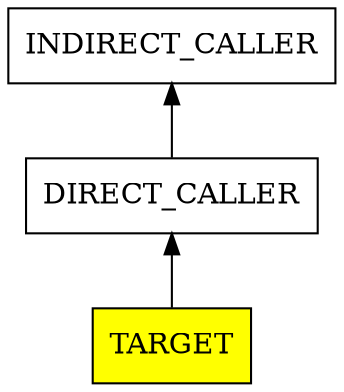

# WBS-025: Change Impact Analyzer

## Task Breakdown

| # | Task | Description | Status |
|---|------|-------------|--------|
| 1 | Add GetImpactedFunctions method | CallGraphAnalyzer に逆方向探索メソッド追加 | [○] |
| 2 | Add GenerateReverseGraph method | 逆方向DOTグラフ出力メソッド追加 | [○] |
| 3 | Add GetFunctionFile helper | ファイル情報取得ヘルパー追加 | [○] |
| 4 | Update LinterOptions | --impact, --reverse-graph オプション追加 | [○] |
| 5 | Add impact subcommand | Program.cs に impact サブコマンド追加 | [○] |
| 6 | Integration Test | 実際のERBファイルで動作確認 | [○] |
| 7 | Documentation | Acceptance criteria 更新 | [○] |

## Test Specifications

| # | Test Name | Input | Expected | Status |
|---|-----------|-------|----------|--------|
| T1 | GetImpactedFunctions_DirectCallers | NTR_SEX | Returns callers at depth 1 | [○] |
| T2 | GetImpactedFunctions_IndirectCallers | NTR_SEX --depth 2 | Returns depth 1+2 callers | [○] |
| T3 | GetImpactedFunctions_DepthLimit | VISITER_DO | Returns callers with depth | [○] |
| T4 | GetImpactedFunctions_UnknownFunction | NONEXISTENT_FUNC | Warning + empty result | [○] |
| T5 | GenerateReverseGraph_DOTOutput | NTR_SEX --reverse-graph | Valid DOT with edges | [○] |
| T6 | CLI_ImpactCommand_Help | impact --help | Help text displayed | [○] |
| T7 | CLI_ImpactCommand_Report | impact -f NTR_SEX | Impact report with files | [○] |

## Implementation Notes

### Task 1: GetImpactedFunctions

Reverse BFS from target function following `_callers` dictionary:

```csharp
public Dictionary<string, int> GetImpactedFunctions(string targetFunction, int? maxDepth = null)
{
    // Returns: caller -> depth from target
    // BFS using _callers (not _callees)
}
```

### Task 2: GenerateReverseGraph

DOT output with arrows pointing from callee to caller (reverse direction):



### Task 3: GetFunctionFile Helper

Helper method to get file path for a function (simplified from ImpactReport class).

### Task 4: LinterOptions

```csharp
public string? ImpactFunction { get; set; }  // -f, --function <function>
public bool ReverseGraph { get; set; }       // --reverse-graph
```

### Task 5: Program.cs

```csharp
if (args.Length > 0 && args[0] == "impact")
{
    return RunImpact(options);
}
```

## Log

| Date | Task | Files | Notes |
|------|------|-------|-------|
| 2025-12-12 | 1-3 | CallGraphAnalyzer.cs | Added GetImpactedFunctions, GenerateReverseGraph, GetFunctionFile |
| 2025-12-12 | 4 | LinterOptions.cs | Added Impact, ImpactFunction, ReverseGraph options |
| 2025-12-12 | 5 | Program.cs | Added RunImpact, ParseImpactArguments, PrintImpactHelp |
| 2025-12-12 | 6-7 | - | CLI tests: --help, text report, DOT output, depth limit |

## Links

- [feature-025.md](feature-025.md) - Feature specification
- [feature-024.md](feature-024.md) - Function call graph (dependency)
- [index-features.md](index-features.md) - Feature tracking
